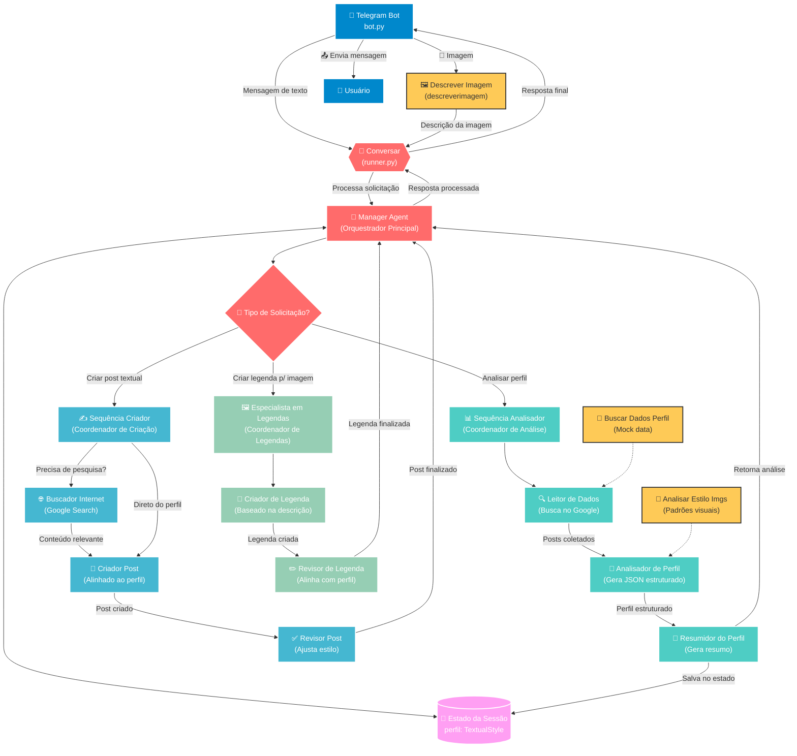
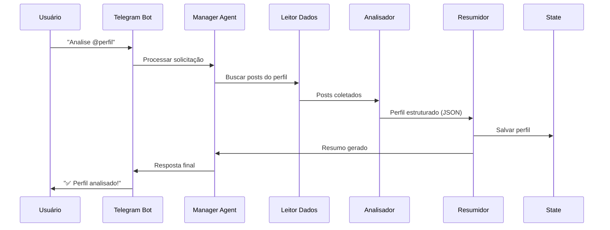
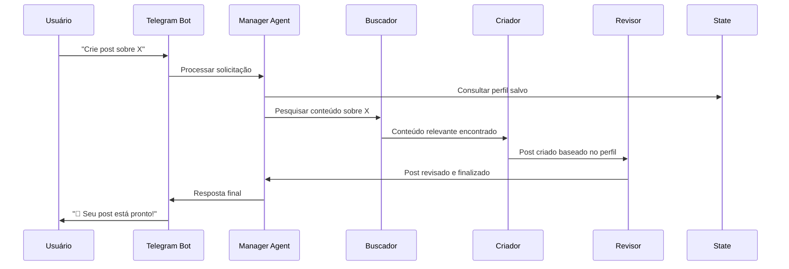

# 🤖 CloneMe - Instagram Style Cloning Bot

Um bot inteligente do Telegram que analisa perfis do Instagram e clona o estilo de escrita para criar conteúdo personalizado usando arquitetura multi-agente com LangGraph.

## 📋 Índice

- [Visão Geral](#-visão-geral)
- [Funcionalidades](#-funcionalidades)
- [Arquitetura](#️-arquitetura)
- [Instalação](#-instalação)
- [Configuração](#️-configuração)
- [Como Usar](#-como-usar)
- [Estrutura do Projeto](#-estrutura-do-projeto)
- [Fluxo dos Agentes](#-fluxo-dos-agentes)
- [Tecnologias](#️-tecnologias)
- [Desenvolvimento](#-desenvolvimento)
- [Contribuição](#-contribuição)
- [Licença](#-licença)

## 🎯 Visão Geral

O **CloneMe** é um sistema avançado de IA que utiliza múltiplos agentes especializados para:

1. **Analisar** perfis do Instagram e extrair padrões de escrita
2. **Clonar** o estilo textual identificado
3. **Gerar** conteúdo original mantendo a personalidade do perfil
4. **Criar** legendas personalizadas para imagens

O bot funciona através do Telegram e mantém o contexto da sessão para cada usuário, permitindo interações contínuas e consistentes.

## ✨ Funcionalidades

### 🔍 Análise de Perfil
- 🎯 Busca automática de posts no Instagram via Google Search
- 📊 Extração de padrões linguísticos e estilo de escrita
- 📋 Geração de perfil estruturado seguindo schema `TextualStyle`
- 📝 Resumo conciso das características identificadas

### ✍️ Criação de Conteúdo
- 📱 Geração de posts textuais no estilo do perfil analisado
- 🌐 Pesquisa de conteúdo relevante na internet
- ✅ Revisão automática para garantir alinhamento com o estilo
- 📈 Adaptação de trending topics ao tom do perfil

### 🖼️ Legendas Inteligentes
- 👁️ Análise automática de imagens enviadas
- 💬 Criação de legendas personalizadas baseadas no perfil
- ✏️ Revisão e ajuste fino do conteúdo gerado
- 🎨 Manutenção da consistência estilística

### 💾 Gerenciamento de Estado
- 🔄 Persistência do perfil durante a sessão
- 📚 Histórico de interações por usuário
- 🧠 Contexto mantido entre diferentes tipos de solicitação

## 🏗️ Arquitetura

O sistema utiliza uma **arquitetura multi-agente hierárquica** com LangGraph:



### 🎯 **Agentes Principais**

#### **Manager Agent (Orquestrador)**
- Recebe todas as solicitações do Telegram
- Mantém o estado da sessão com perfil do usuário
- Decide qual sub-agente acionar baseado no contexto
- Coordena o fluxo entre diferentes especialistas

#### **📊 Sequência Analisador** 
Coordena a análise completa de perfis através de:
- **🔍 Leitor de Dados**: Busca posts no Google
- **🧠 Analisador de Perfil**: Estrutura dados em JSON
- **📝 Resumidor do Perfil**: Gera resumo conciso

#### **✍️ Sequência Criador**
Coordena a criação de conteúdo através de:
- **🌐 Buscador Internet**: Pesquisa conteúdo relevante
- **📝 Criador Post**: Gera posts alinhados ao perfil
- **✅ Revisor Post**: Ajusta estilo e qualidade

#### **🖼️ Especialista em Legendas**
Especializado em legendas para imagens através de:
- **💬 Criador de Legenda**: Gera legendas personalizadas
- **✏️ Revisor de Legenda**: Alinha com perfil do usuário

## 🚀 Instalação

### Pré-requisitos
- **Python 3.8+**
- **Conta no Telegram** (para criar o bot)
- **Chaves de API da OpenAI**
- **Chaves de API do Google Search** (opcional)

### Passos

1. **Clone o repositório**
```bash
git clone https://github.com/lucaspyoshida/CloneMe.git
cd CloneMe
```

2. **Instale as dependências com Poetry**
```bash
# Se você tem Poetry instalado
poetry install

# Ou usando pip
pip install -r requirements.txt
```

3. **Configure as variáveis de ambiente**
```bash
cp .env.example .env
```

## ⚙️ Configuração

Crie um arquivo `.env` na raiz do projeto com as seguintes variáveis:

```env
# Telegram Bot Token (obtido via @BotFather)
TELEGRAM_TOKEN=seu_token_telegram_aqui

# OpenAI API Key
OPENAI_API_KEY=sua_chave_openai_aqui

# Google Search API (opcional, para busca de perfis)
GOOGLE_API_KEY=sua_chave_google_aqui
GOOGLE_CSE_ID=seu_cse_id_aqui

# Configurações de logging
LOG_LEVEL=INFO
```

### 🔑 Como obter as chaves:

#### 🤖 **Token do Telegram**
1. Abra o Telegram e procure por `@BotFather`
2. Envie `/newbot` e siga as instruções
3. Escolha um nome e username para seu bot
4. Copie o token fornecido

#### 🧠 **OpenAI API Key**
1. Acesse [OpenAI Platform](https://platform.openai.com)
2. Crie uma conta ou faça login
3. Vá em "API Keys" e crie uma nova chave
4. Copie a chave gerada (mantenha segura!)

#### 🔍 **Google Search API** (Opcional)
1. Acesse [Google Cloud Console](https://console.cloud.google.com)
2. Crie um projeto ou selecione um existente
3. Ative a "Custom Search API"
4. Crie um Custom Search Engine em [CSE](https://cse.google.com)
5. Configure para buscar em toda a web

## 📱 Como Usar

### 🚀 Iniciando o Bot

```bash
# Método 1: Diretamente
python bot.py

# Método 2: Com Poetry
poetry run python bot.py

# Método 3: Com logs detalhados
LOG_LEVEL=DEBUG python bot.py
```

### 💬 Comandos e Interações

#### 📊 **Análise de Perfil**
```
👤 Usuário: "Analise o perfil @nomeusuario"
🤖 Bot: "🔍 Analisando o perfil @nomeusuario..."
🤖 Bot: "✅ Análise concluída! Identifiquei as seguintes características..."
```

**O que acontece:**
- Busca posts do perfil no Instagram via Google
- Analisa padrões de linguagem, tom e estilo
- Salva o perfil na sessão do usuário
- Retorna um resumo detalhado

#### ✍️ **Criação de Conteúdo**
```
👤 Usuário: "Crie um post sobre tecnologia"
🤖 Bot: "📝 Criando post sobre tecnologia no seu estilo..."
🤖 Bot: "🚀 A tecnologia tá mudando tudo, gente! Cada dia..."
```

**O que acontece:**
- Busca informações atuais sobre o tema
- Gera conteúdo seguindo o perfil analisado
- Revisa e ajusta o tom e estilo
- Retorna o post personalizado

#### 🖼️ **Legendas para Imagens**
```
👤 Usuário: [Envia uma foto]
🤖 Bot: "📸 Analisando sua imagem..."
🤖 Bot: "Esse momento é simplesmente mágico! ✨ Quando a natureza..."
```

**O que acontece:**
- Analisa a imagem usando OpenAI Vision
- Identifica elementos, cores, composição
- Cria legenda no estilo do perfil
- Adiciona emojis e hashtags apropriadas

### 📋 **Exemplos Práticos**

#### Cenário 1: Influencer de Fitness
```
Usuário: "Analise o perfil @fitness_girl"
Bot: "✅ Perfil analisado! Estilo motivacional, uso frequente de 💪🔥, linguagem encorajadora..."

Usuário: "Crie um post sobre alimentação saudável"
Bot: "🥗 Gente, vamos falar sério sobre alimentação! Não é sobre ser perfeito, é sobre fazer escolhas que te fazem sentir INCRÍVEL! 💪✨ #VivaLeve #AlimentacaoConsciente"
```

#### Cenário 2: Travel Blogger
```
Usuário: "Analise o perfil @travel_adventures"
Bot: "✅ Perfil analisado! Tom aventureiro, storytelling envolvente, emojis de viagem..."

Usuário: [Envia foto de uma praia]
Bot: "🏖️ Esse paraíso me lembra por que escolhi essa vida nômade... Cada pôr do sol é uma promessa de que amanhã teremos uma nova aventura esperando! 🌅✈️ #Wanderlust #Paradise"
```

## 📁 Estrutura do Projeto

```
CloneMe/
├── 📱 bot.py                           # Interface Telegram principal
├── 🔄 runner.py                        # Orquestrador de conversas
├── 📋 pyproject.toml                   # Configuração Poetry
├── 📋 requirements.txt                 # Dependências pip
├── 🔧 .env                            # Variáveis de ambiente
├── 📚 README.md                       # Documentação
├── 💾 my_agent_data.db                # Banco de dados local
│
├── 🎯 manager_agent/                   # Agente principal
│   ├── __init__.py
│   ├── agent.py                       # Lógica do manager
│   │
│   ├── 🛠️ tools/                      # Ferramentas auxiliares
│   │   ├── descrever_uma_img.py       # Análise de imagens OpenAI
│   │   ├── buscar_dados_perfil.py     # Busca de dados de perfil
│   │   ├── analisar_estilo_imgs.py    # Análise de estilo visual
│   │   ├── lerperfil.py              # Leitor de perfil salvo
│   │   └── state_schema.py            # Schema de estado TypedDict
│   │
│   ├── 📸 imgs/                       # Imagens de exemplo
│   │   ├── img.png
│   │   └── img2.png
│   │
│   ├── 🔧 shared/                     # Recursos compartilhados
│   │   └── constants.py               # Constantes do sistema
│   │
│   └── 🤖 sub_agents/                 # Agentes especializados
│       │
│       ├── 📊 analisador_de_perfil/   # Análise de perfis IG
│       │   ├── agent.py               # Coordenador sequencial
│       │   └── sub_agents_analisador/
│       │       ├── leitor_de_dados.py      # Google Search
│       │       ├── analisador_em_si.py     # Estruturação JSON
│       │       └── resumidor_do_perfil.py  # Geração de resumo
│       │
│       ├── ✍️ criador_de_conteudo/    # Criação de posts
│       │   ├── agent.py               # Coordenador sequencial
│       │   └── sub_agents_criador/
│       │       ├── buscador_internet.py    # Pesquisa de trending
│       │       ├── criador_post.py         # Geração de conteúdo
│       │       └── revisor_post.py         # Revisão de qualidade
│       │
│       └── 🖼️ agente_especialista_em_legendas/  # Legendas de imagem
│           ├── agent.py               # Coordenador sequencial
│           └── sub_agentes_legenda/
│               ├── criador_de_legenda.py   # Criação de legendas
│               └── revisor_de_legenda.py   # Revisão de legendas
│
└── 📁 posts/                          # Dados de perfis salvos
    └── 173775906/                     # ID do usuário
        ├── posts.txt                  # Posts coletados
        └── img/                       # Imagens do perfil
            └── *.jpg
```

## 🔄 Fluxo dos Agentes

### 🎯 **Fluxo Principal**

```python
# 1. Entrada via Telegram
async def echo_handler(message: Message):
    if message.text:
        response = await conversar(message.text, str(user_id))
    elif message.photo:
        descricao = descreverimagem(base64_image)
        response = await conversar(descricao, str(user_id))
```

### 🧠 **Processo de Decisão**

```python
# 2. Manager Agent analisa e decide
def should_run_analisador_de_perfil(state):
    return "analis" in state.get("messages", [])[-1].content.lower()

def should_run_criador_de_conteudo(state):
    return "crie" in state.get("messages", [])[-1].content.lower()

def should_run_agente_especialista_em_legendas(state):
    return "imagem:" in state.get("messages", [])[-1].content
```

### 📊 **Fluxo de Análise**



### ✍️ **Fluxo de Criação**



## 🛠️ Tecnologias

### **Core Framework**
- **Python 3.8+** - Linguagem principal
- **LangGraph** - Orquestração de agentes multi-step
- **LangChain** - Framework para aplicações LLM
- **asyncio** - Programação assíncrona

### **Inteligência Artificial**
- **OpenAI GPT-4** - Modelo de linguagem principal
- **OpenAI Vision** - Análise e descrição de imagens
- **Custom Prompts** - Prompts especializados por agente

### **Telegram Bot**
- **aiogram 3.x** - Framework moderno para bots Telegram
- **ChatActionSender** - Indicadores de digitação
- **File Handling** - Upload/download de imagens

### **Busca e Dados**
- **Google Search API** - Busca de posts do Instagram
- **Web Scraping** - Coleta de dados públicos
- **JSON Schema** - Estruturação de dados

### **Gerenciamento**
- **Poetry** - Gerenciamento de dependências
- **python-dotenv** - Variáveis de ambiente
- **SQLite** - Banco de dados local (via LangGraph)
- **logging** - Sistema de logs estruturado

### **Desenvolvimento**
- **Type Hints** - Tipagem estática Python
- **Pydantic** - Validação de dados
- **AsyncIO** - Operações assíncronas
- **Error Handling** - Tratamento robusto de erros

## 🔧 Desenvolvimento

### **Executando em Desenvolvimento**

```bash
# Logs detalhados
LOG_LEVEL=DEBUG python bot.py

# Testando componentes individuais
python -c "from manager_agent.tools.descrever_uma_img import descreverimagem; print('OK')"

# Executando com Poetry
poetry run python bot.py

# Instalando dependências de desenvolvimento
poetry install --with dev
```

### **Estrutura de Estado**

```python
from typing import TypedDict, List, Optional

class TextualStyle(TypedDict):
    """Schema que define o perfil textual de um usuário"""
    writing_tone: str              # "casual", "formal", "motivacional"
    vocabulary_level: str          # "simples", "intermediário", "avançado"
    sentence_structure: str        # "curtas", "médias", "longas", "mistas"
    emoji_usage: str              # "frequente", "moderado", "raro", "nunca"
    hashtag_style: str            # "muitas", "poucas", "específicas", "trending"
    interaction_style: str        # "questionador", "afirmativo", "storytelling"
    content_themes: List[str]     # ["fitness", "viagem", "food", "lifestyle"]
    typical_post_length: str      # "curto", "médio", "longo"
    call_to_action_style: str     # "direto", "sutil", "emocional", "questionador"
    personal_voice_notes: str     # Observações específicas do estilo
```

### **Adicionando Novos Agentes**

1. **Crie a estrutura do agente**
```python
# manager_agent/sub_agents/novo_agente/agent.py
from langgraph.graph import StateGraph
from manager_agent.tools.state_schema import AgentState

def novo_agente_workflow():
    workflow = StateGraph(AgentState)
    
    # Adicione seus nós
    workflow.add_node("processar", processar_funcao)
    workflow.add_node("validar", validar_funcao)
    
    # Defina as transições
    workflow.add_edge("processar", "validar")
    workflow.set_entry_point("processar")
    workflow.set_finish_point("validar")
    
    return workflow.compile()
```

2. **Registre no Manager Agent**
```python
# manager_agent/agent.py

# Adicione a condição
def should_run_novo_agente(state):
    return "palavra_chave" in state.get("messages", [])[-1].content.lower()

# Registre no workflow
workflow.add_conditional_edges(
    "manager_node",
    router,
    {
        # ...existing agents...
        "novo_agente": "novo_agente_workflow",
    }
)
```

3. **Implemente as funções**
```python
def processar_funcao(state: AgentState):
    # Sua lógica aqui
    return {"messages": state["messages"] + [response]}

def validar_funcao(state: AgentState):
    # Validação e ajustes
    return {"messages": state["messages"] + [validated_response]}
```

### **Debugging e Logs**

```python
import logging

# Configure logs detalhados
logging.basicConfig(
    level=logging.DEBUG,
    format='%(asctime)s - %(name)s - %(levelname)s - %(message)s'
)

# Use nos seus agentes
logger = logging.getLogger(__name__)
logger.info(f"Processando solicitação: {user_input}")
logger.debug(f"Estado atual: {state}")
```

### **Testando Componentes**

```python
# Teste individual de ferramentas
def test_descrever_imagem():
    from manager_agent.tools.descrever_uma_img import descreverimagem
    
    # Imagem de teste em base64
    test_image = "iVBORw0KGgoAAAANSUhEUgAAAAEAAAABCAYAAAAfFcSJAAAADUlEQVR42mP8/5+hHgAHggJ/PchI7wAAAABJRU5ErkJggg=="
    
    result = descreverimagem(test_image)
    print(f"Resultado: {result}")

# Teste de agentes
async def test_manager_agent():
    from runner import conversar
    
    response = await conversar("Analise o perfil @test", "123")
    print(f"Resposta: {response}")
```

## 🤝 Contribuição

### **Como Contribuir**

1. **Fork** o repositório
2. **Clone** seu fork localmente
```bash
git clone https://github.com/seu-usuario/CloneMe.git
cd CloneMe
```

3. **Crie uma branch** para sua feature
```bash
git checkout -b feature/nova-funcionalidade
```

4. **Desenvolva** sua funcionalidade
   - Mantenha o código limpo e documentado
   - Siga os padrões existentes
   - Adicione type hints quando possível

5. **Teste** suas mudanças
```bash
# Execute os testes
python -m pytest tests/

# Teste manualmente
python bot.py
```

6. **Commit** suas mudanças
```bash
git add .
git commit -m "feat: adiciona nova funcionalidade X"
```

7. **Push** para sua branch
```bash
git push origin feature/nova-funcionalidade
```

8. **Abra um Pull Request**
   - Descreva as mudanças claramente
   - Adicione screenshots se aplicável
   - Referencie issues relacionadas

### **Diretrizes de Código**

```python
# ✅ Bom exemplo
async def processar_mensagem(
    mensagem: str, 
    user_id: str, 
    perfil: TextualStyle
) -> str:
    """
    Processa uma mensagem do usuário usando o perfil definido.
    
    Args:
        mensagem: Texto da mensagem do usuário
        user_id: ID único do usuário
        perfil: Perfil textual para personalização
        
    Returns:
        Resposta processada no estilo do perfil
    """
    logger.info(f"Processando mensagem do usuário {user_id}")
    
    try:
        # Sua lógica aqui
        resultado = await gerar_resposta(mensagem, perfil)
        return resultado
        
    except Exception as e:
        logger.error(f"Erro ao processar mensagem: {e}")
        return "Desculpe, ocorreu um erro. Tente novamente."
```

### **Tipos de Contribuição**

- 🐛 **Bug Fixes** - Correção de problemas
- ✨ **Novas Features** - Funcionalidades adicionais
- 📚 **Documentação** - Melhorias na documentação
- 🎨 **UI/UX** - Melhorias na experiência do usuário
- ⚡ **Performance** - Otimizações de performance
- 🧪 **Testes** - Adição ou melhoria de testes

### **Reportando Issues**

Use o [sistema de Issues do GitHub](https://github.com/seu-usuario/CloneMe/issues) incluindo:

```markdown
## 🐛 Descrição do Bug
Descrição clara e concisa do problema.

## 🔄 Passos para Reproduzir
1. Vá para '...'
2. Clique em '...'
3. Execute '...'
4. Veja o erro

## ✅ Comportamento Esperado
O que deveria acontecer.

## ❌ Comportamento Atual
O que está acontecendo atualmente.

## 📱 Ambiente
- OS: [e.g. macOS, Windows, Linux]
- Python: [e.g. 3.9.0]
- Versão do CloneMe: [e.g. 1.0.0]

## 📋 Logs Adicionais
```
[Cole aqui os logs relevantes]
```

## 📸 Screenshots
Se aplicável, adicione screenshots.
```

## 📄 Licença

Este projeto está licenciado sob a **MIT License**.

```
MIT License

Copyright (c) 2025 CloneMe Project

Permission is hereby granted, free of charge, to any person obtaining a copy
of this software and associated documentation files (the "Software"), to deal
in the Software without restriction, including without limitation the rights
to use, copy, modify, merge, publish, distribute, sublicense, and/or sell
copies of the Software, and to permit persons to whom the Software is
furnished to do so, subject to the following conditions:

The above copyright notice and this permission notice shall be included in all
copies or substantial portions of the Software.

THE SOFTWARE IS PROVIDED "AS IS", WITHOUT WARRANTY OF ANY KIND, EXPRESS OR
IMPLIED, INCLUDING BUT NOT LIMITED TO THE WARRANTIES OF MERCHANTABILITY,
FITNESS FOR A PARTICULAR PURPOSE AND NONINFRINGEMENT. IN NO EVENT SHALL THE
AUTHORS OR COPYRIGHT HOLDERS BE LIABLE FOR ANY CLAIM, DAMAGES OR OTHER
LIABILITY, WHETHER IN AN ACTION OF CONTRACT, TORT OR OTHERWISE, ARISING FROM,
OUT OF OR IN CONNECTION WITH THE SOFTWARE OR THE USE OR OTHER DEALINGS IN THE
SOFTWARE.
```

---

## 🚧 Roadmap

### **Versão 1.1 (Próxima)**
- [ ] 🎨 Análise de estilo visual das imagens
- [ ] 📊 Dashboard web para gerenciar perfis
- [ ] 🔄 Integração com mais redes sociais
- [ ] 📈 Analytics de engajamento

### **Versão 1.2 (Futuro)**
- [ ] 🤖 Auto-posting agendado
- [ ] 👥 Múltiplos perfis por usuário
- [ ] 🎯 A/B testing de conteúdo
- [ ] 📱 App mobile nativo

### **Versão 2.0 (Visão)**
- [ ] 🧠 Fine-tuning de modelos personalizados
- [ ] 🎬 Suporte a vídeos e Stories
- [ ] 🌍 Localização multi-idioma
- [ ] ☁️ Versão em nuvem (SaaS)

## 🙏 Agradecimentos

- **OpenAI** - Pelos incríveis modelos GPT-4 e Vision
- **LangChain Team** - Pelo framework LangGraph que torna multi-agentes possível
- **Telegram** - Pela API robusta e bem documentada
- **Comunidade Python** - Por todas as bibliotecas que tornaram isso possível
- **Instagram** - Por inspirar a criação de conteúdo autêntico
- **Contribuidores** - Todos que ajudaram a melhorar este projeto

---

## 📞 Contato

- **GitHub**: [@seu-usuario](https://github.com/seu-usuario)
- **Email**: seu.email@exemplo.com
- **LinkedIn**: [Seu Nome](https://linkedin.com/in/seu-perfil)
- **Twitter**: [@seu_twitter](https://twitter.com/seu_twitter)

---

<div align="center">

**⭐ Se este projeto te ajudou, deixe uma estrela no GitHub! ⭐**

**Desenvolvido com ❤️ usando Python e IA**

[](https://github.com/seu-usuario/CloneMe)
[](https://github.com/seu-usuario/CloneMe/fork)
[](https://github.com/seu-usuario/CloneMe)

</div>