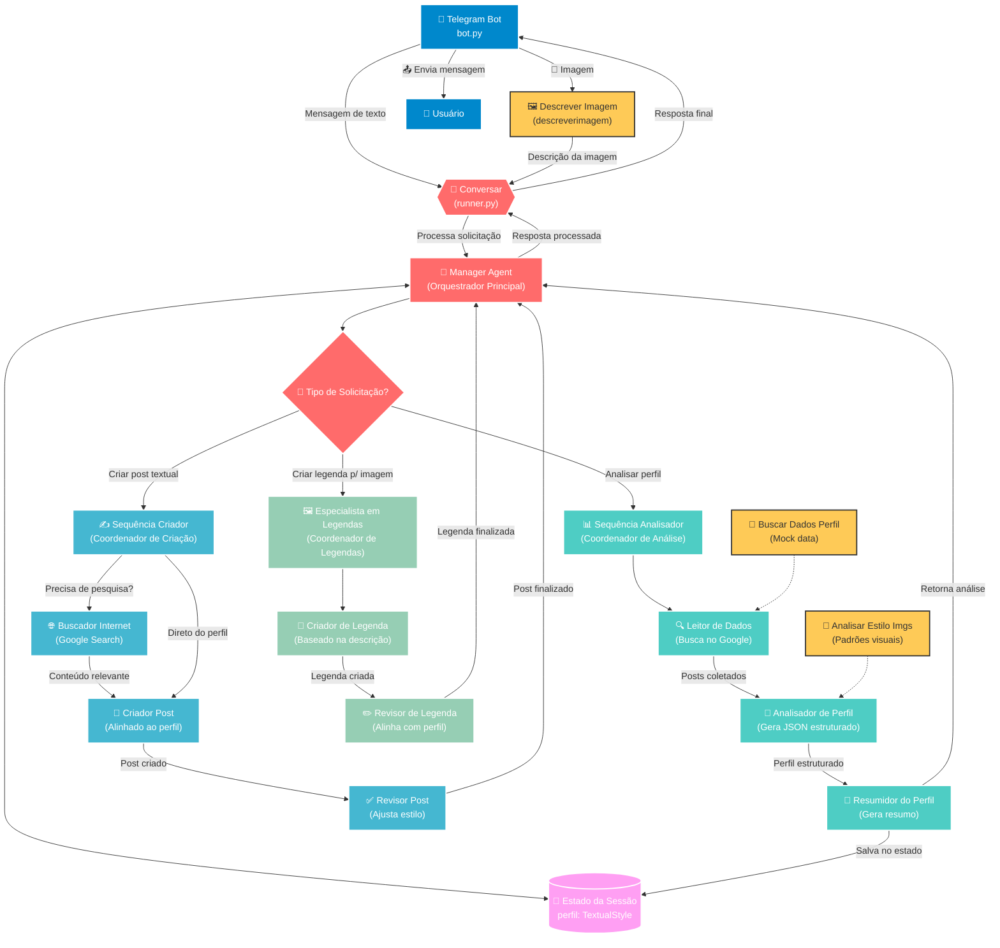
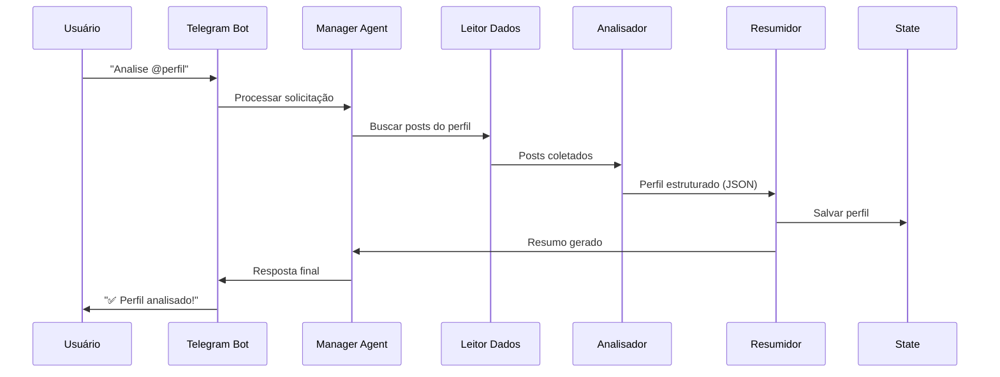
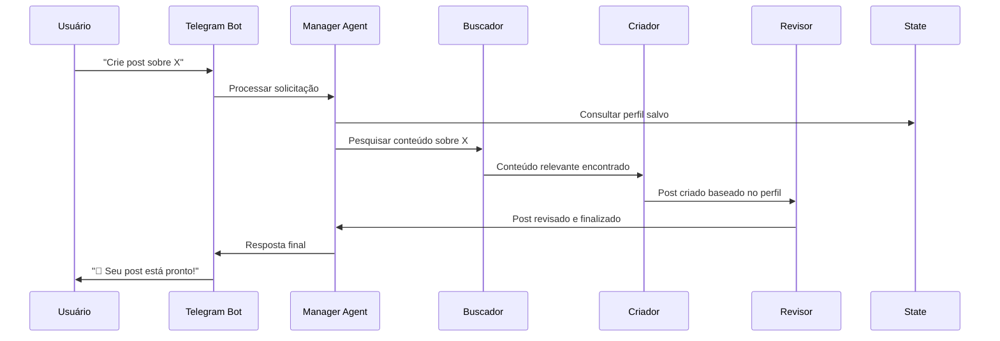

# 🤖 CloneMe - Instagram Style Cloning Bot

Um bot inteligente do Telegram que analisa perfis do Instagram e clona o estilo de escrita para criar conteúdo personalizado usando arquitetura multi-agente com LangGraph.

## 📋 Índice

- [Visão Geral](#-visão-geral)
- [Funcionalidades](#-funcionalidades)
- [Arquitetura](#️-arquitetura)
- [Instalação](#-instalação)
- [Configuração](#️-configuração)
- [Como Usar](#-como-usar)
- [Estrutura do Projeto](#-estrutura-do-projeto)
- [Fluxo dos Agentes](#-fluxo-dos-agentes)
- [Tecnologias](#️-tecnologias)

## 🎯 Visão Geral

O **CloneMe** é um sistema avançado de IA que utiliza múltiplos agentes especializados para:

1. **Analisar** perfis do Instagram e extrair padrões de escrita
2. **Clonar** o estilo textual identificado
3. **Gerar** conteúdo original mantendo a personalidade do perfil
4. **Criar** legendas personalizadas para imagens

O bot funciona através do Telegram e mantém o contexto da sessão para cada usuário, permitindo interações contínuas e consistentes.

## ✨ Funcionalidades

### 🔍 Análise de Perfil
- 🎯 Busca automática de posts no Instagram via Google Search
- 📊 Extração de padrões linguísticos e estilo de escrita
- 📋 Geração de perfil estruturado seguindo schema `TextualStyle`
- 📝 Resumo conciso das características identificadas

### ✍️ Criação de Conteúdo
- 📱 Geração de posts textuais no estilo do perfil analisado
- 🌐 Pesquisa de conteúdo relevante na internet
- ✅ Revisão automática para garantir alinhamento com o estilo
- 📈 Adaptação de trending topics ao tom do perfil

### 🖼️ Legendas Inteligentes
- 👁️ Análise automática de imagens enviadas
- 💬 Criação de legendas personalizadas baseadas no perfil
- ✏️ Revisão e ajuste fino do conteúdo gerado
- 🎨 Manutenção da consistência estilística

### 💾 Gerenciamento de Estado
- 🔄 Persistência do perfil durante a sessão
- 📚 Histórico de interações por usuário
- 🧠 Contexto mantido entre diferentes tipos de solicitação

## 🏗️ Arquitetura

O sistema utiliza uma **arquitetura multi-agente hierárquica** com LangGraph:



### 🎯 **Agentes Principais**

#### **Manager Agent (Orquestrador)**
- Recebe todas as solicitações do Telegram
- Mantém o estado da sessão com perfil do usuário
- Decide qual sub-agente acionar baseado no contexto
- Coordena o fluxo entre diferentes especialistas

#### **📊 Sequência Analisador** 
Coordena a análise completa de perfis através de:
- **🔍 Leitor de Dados**: Busca posts no Google
- **🧠 Analisador de Perfil**: Estrutura dados em JSON
- **📝 Resumidor do Perfil**: Gera resumo conciso

#### **✍️ Sequência Criador**
Coordena a criação de conteúdo através de:
- **🌐 Buscador Internet**: Pesquisa conteúdo relevante
- **📝 Criador Post**: Gera posts alinhados ao perfil
- **✅ Revisor Post**: Ajusta estilo e qualidade

#### **🖼️ Especialista em Legendas**
Especializado em legendas para imagens através de:
- **💬 Criador de Legenda**: Gera legendas personalizadas
- **✏️ Revisor de Legenda**: Alinha com perfil do usuário

## 🚀 Instalação

### Pré-requisitos
- **Python 3.8+**
- **Conta no Telegram** (para criar o bot)
- **Chaves de API da OpenAI**
- **Chaves de API do Google Console** 

### Passos

1. **Clone o repositório**
```bash
git clone https://github.com/lucaspyoshida/CloneMe.git
cd CloneMe
```

2. **Instale as dependências com Poetry**
```bash
# Se você tem Poetry instalado
poetry install

# Ou usando pip
pip install -r requirements.txt
```

3. **Configure as variáveis de ambiente**
```bash
cp .env.example .env
```

## ⚙️ Configuração

Crie um arquivo `.env` na raiz do projeto com as seguintes variáveis:

```env
# Telegram Bot Token (obtido via @BotFather)
TELEGRAM_TOKEN=seu_token_telegram_aqui

# OpenAI API Key
OPENAI_API_KEY=sua_chave_openai_aqui

# Google Search API (opcional, para busca de perfis)
GOOGLE_API_KEY=sua_chave_google_aqui

```

### 🔑 Como obter as chaves:

#### 🤖 **Token do Telegram**
1. Abra o Telegram e procure por `@BotFather`
2. Envie `/newbot` e siga as instruções
3. Escolha um nome e username para seu bot
4. Copie o token fornecido

#### 🧠 **OpenAI API Key**
1. Acesse [OpenAI Platform](https://platform.openai.com)
2. Crie uma conta ou faça login
3. Vá em "API Keys" e crie uma nova chave
4. Copie a chave gerada (mantenha segura!)

#### 🔍 **Google Console API Key** (Opcional)
1. Acesse [Google Cloud Console](https://console.cloud.google.com)
2. Crie um projeto ou selecione um existente
3. Ative uma API Key

## 📱 Como Usar

### 🚀 Iniciando o Bot

```bash
# Método 1: Diretamente
python bot.py

# Método 2: Com Poetry
poetry run python bot.py

```

### 💬 Comandos e Interações

#### 📊 **Análise de Perfil**
```
👤 Usuário: "Analise o perfil @nomeusuario"
🤖 Bot: "🔍 Analisando o perfil @nomeusuario..."
🤖 Bot: "✅ Análise concluída! Identifiquei as seguintes características..."
```

**O que acontece:**
- Busca posts do perfil no Instagram via Google
- Analisa padrões de linguagem, tom e estilo
- Salva o perfil na sessão do usuário
- Retorna um resumo detalhado

#### ✍️ **Criação de Conteúdo**
```
👤 Usuário: "Crie um post sobre tecnologia"
🤖 Bot: "📝 Criando post sobre tecnologia no seu estilo..."
🤖 Bot: "🚀 A tecnologia tá mudando tudo, gente! Cada dia..."
```

**O que acontece:**
- Busca informações atuais sobre o tema
- Gera conteúdo seguindo o perfil analisado
- Revisa e ajusta o tom e estilo
- Retorna o post personalizado

#### 🖼️ **Legendas para Imagens**
```
👤 Usuário: [Envia uma foto]
🤖 Bot: "📸 Analisando sua imagem..."
🤖 Bot: "Esse momento é simplesmente mágico! ✨ Quando a natureza..."
```

**O que acontece:**
- Analisa a imagem usando OpenAI Vision
- Identifica elementos, cores, composição
- Cria legenda no estilo do perfil
- Adiciona emojis e hashtags apropriadas

### 📋 **Exemplos Práticos**

#### Cenário 1: Influencer de Fitness
```
Usuário: "Analise o perfil @fitness_girl"
Bot: "✅ Perfil analisado! Estilo motivacional, uso frequente de 💪🔥, linguagem encorajadora..."

Usuário: "Crie um post sobre alimentação saudável"
Bot: "🥗 Gente, vamos falar sério sobre alimentação! Não é sobre ser perfeito, é sobre fazer escolhas que te fazem sentir INCRÍVEL! 💪✨ #VivaLeve #AlimentacaoConsciente"
```

#### Cenário 2: Travel Blogger
```
Usuário: "Analise o perfil @travel_adventures"
Bot: "✅ Perfil analisado! Tom aventureiro, storytelling envolvente, emojis de viagem..."

Usuário: [Envia foto de uma praia]
Bot: "🏖️ Esse paraíso me lembra por que escolhi essa vida nômade... Cada pôr do sol é uma promessa de que amanhã teremos uma nova aventura esperando! 🌅✈️ #Wanderlust #Paradise"
```

## 📁 Estrutura do Projeto

```
CloneMe/
├── 📱 bot.py                           # Interface Telegram principal
├── 🔄 runner.py                        # Orquestrador de conversas
├── 📋 pyproject.toml                   # Configuração Poetry
├── 📋 requirements.txt                 # Dependências pip
├── 🔧 .env                            # Variáveis de ambiente
├── 📚 README.md                       # Documentação
├── 💾 my_agent_data.db                # Banco de dados local
│
├── 🎯 manager_agent/                   # Agente principal
│   ├── __init__.py
│   ├── agent.py                       # Lógica do manager
│   │
│   ├── 🛠️ tools/                      # Ferramentas auxiliares
│   │   ├── descrever_uma_img.py       # Análise de imagens OpenAI
│   │   ├── buscar_dados_perfil.py     # Busca de dados de perfil
│   │   ├── analisar_estilo_imgs.py    # Análise de estilo visual
│   │   ├── lerperfil.py              # Leitor de perfil salvo
│   │   └── state_schema.py            # Schema de estado TypedDict
│   │
│   ├── 📸 imgs/                       # Imagens de exemplo
│   │   ├── img.png
│   │   └── img2.png
│   │
│   ├── 🔧 shared/                     # Recursos compartilhados
│   │   └── constants.py               # Constantes do sistema
│   │
│   └── 🤖 sub_agents/                 # Agentes especializados
│       │
│       ├── 📊 analisador_de_perfil/   # Análise de perfis IG
│       │   ├── agent.py               # Coordenador sequencial
│       │   └── sub_agents_analisador/
│       │       ├── leitor_de_dados.py      # Google Search
│       │       ├── analisador_em_si.py     # Estruturação JSON
│       │       └── resumidor_do_perfil.py  # Geração de resumo
│       │
│       ├── ✍️ criador_de_conteudo/    # Criação de posts
│       │   ├── agent.py               # Coordenador sequencial
│       │   └── sub_agents_criador/
│       │       ├── buscador_internet.py    # Pesquisa de trending
│       │       ├── criador_post.py         # Geração de conteúdo
│       │       └── revisor_post.py         # Revisão de qualidade
│       │
│       └── 🖼️ agente_especialista_em_legendas/  # Legendas de imagem
│           ├── agent.py               # Coordenador sequencial
│           └── sub_agentes_legenda/
│               ├── criador_de_legenda.py   # Criação de legendas
│               └── revisor_de_legenda.py   # Revisão de legendas
│
└── 📁 posts/                          # Dados de perfis salvos
    └── 173775906/                     # ID do usuário
        ├── posts.txt                  # Posts coletados
        └── img/                       # Imagens do perfil
            └── *.jpg
```

## 🔄 Fluxo dos Agentes

### 🎯 **Fluxo Principal**

```python
# 1. Entrada via Telegram
async def echo_handler(message: Message):
    if message.text:
        response = await conversar(message.text, str(user_id))
    elif message.photo:
        descricao = descreverimagem(base64_image)
        response = await conversar(descricao, str(user_id))
```


### 📊 **Fluxo de Análise**



### ✍️ **Fluxo de Criação**



## 🛠️ Tecnologias

### **Core Framework**
- **Python 3.8+** - Linguagem principal
- **asyncio** - Programação assíncrona

### **Inteligência Artificial**
- **Google SDK** - Interface de agentes utilizados
- **OpenAI GPT-4** - Modelo de linguagem
- **Custom Prompts** - Prompts especializados por agente

### **Telegram Bot**
- **aiogram 3.x** - Framework moderno para bots Telegram
- **ChatActionSender** - Indicadores de digitação
- **File Handling** - Upload/download de imagens

### **Busca e Dados**
- **Google Search API** - Busca de posts do Instagram
- **Web Scraping** - Coleta de dados públicos
- **JSON Schema** - Estruturação de dados

### **Gerenciamento**
- **Poetry** - Gerenciamento de dependências
- **python-dotenv** - Variáveis de ambiente
- **SQLite** - Banco de dados local (via LangGraph)

### **Desenvolvimento**
- **Type Hints** - Tipagem estática Python
- **Pydantic** - Validação de dados
- **AsyncIO** - Operações assíncronas
- **Error Handling** - Tratamento robusto de erros

